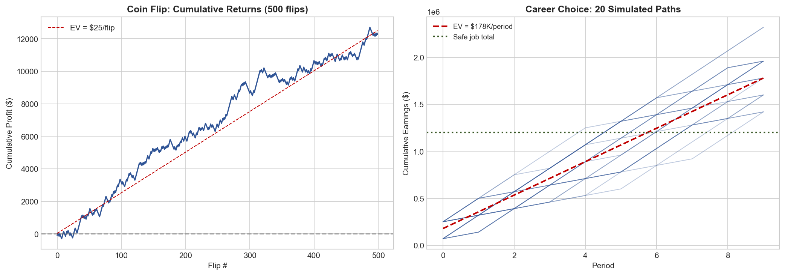
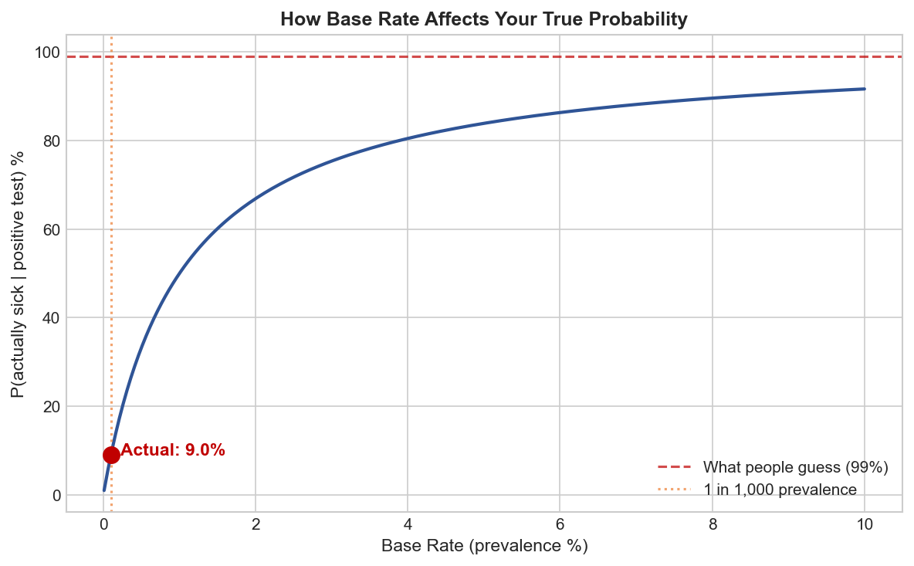
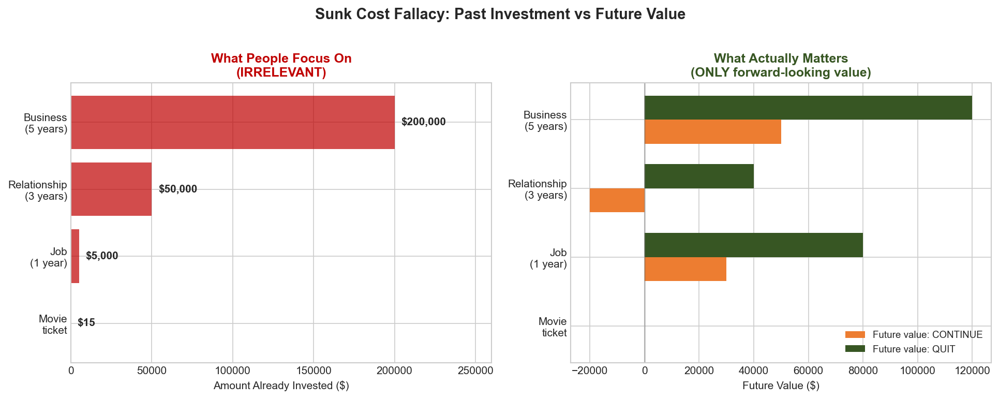
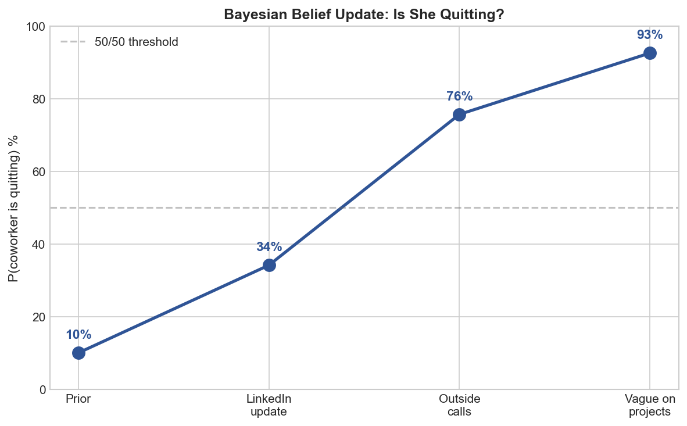
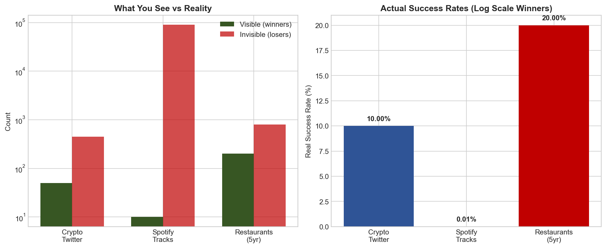
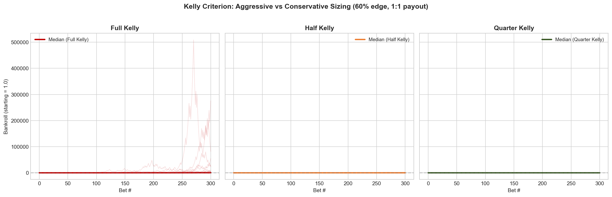
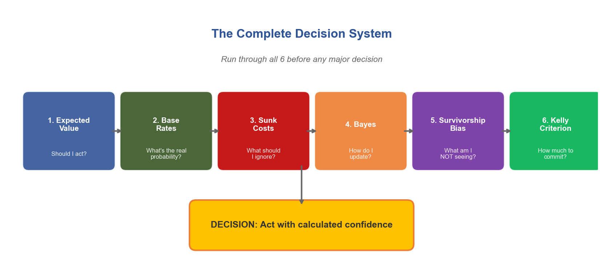

# The Hidden Math Behind Every Decision You Make — And Why Most People Get It Wrong

*Based on [@zodchiii](https://x.com/zodchiii/status/2030267008625873324)*

---

## Table of Contents

1. [Expected Value](#1-expected-value--the-one-formula-that-runs-everything) — Should I act?
2. [Base Rate Neglect](#2-base-rate-neglect--the-reason-youre-wrong-more-than-you-think) — What's the real probability?
3. [Sunk Cost Fallacy](#3-sunk-cost-fallacy--throwing-good-money-after-bad-and-not-just-money) — What should I ignore?
4. [Bayesian Thinking](#4-bayesian-thinking--how-to-update-your-beliefs-like-a-scientist-not-a-politician) — How do I update?
5. [Survivorship Bias](#5-survivorship-bias--youre-only-seeing-the-winners) — What am I NOT seeing?
6. [Kelly Criterion](#6-the-kelly-criterion--how-much-to-bet-when-you-do-have-an-edge) — How much to commit?
7. [How They Connect](#how-all-6-connect-and-why-prediction-markets-are-the-ultimate-training-ground) — The complete system
8. [Quick-Reference Cheat Sheet](#quick-reference-cheat-sheet)
9. [Decision Pre-Flight Checklist](#decision-pre-flight-checklist)
10. [Reading List](#reading-list-if-you-want-to-go-deeper)

---

You make roughly **35,000 decisions a day**.

What to eat. Whether to reply to that email now or later. Take the highway or side streets. Accept the job offer or negotiate. Hold the stock or sell.

I spent 3 months deciding whether to move to Paris by making pro/con lists in my head at 2am. Never wrote anything down. Just vibes. Moved. Hated it within a week.

And for small stuff — what to have for lunch, which Netflix show to watch — vibes are fine. Who cares.

But for the decisions that actually shape your life? Career moves, investments, relationships, health? **Vibes are a disaster.** And I can prove it with math.

This isn't a math lecture btw. No calculus. I promise. This is about **6 mental models** that changed how I think about literally everything — and once you see them, you can't unsee them.

Fair warning: some of this will make you uncomfortable. You'll realize you've been making bad decisions for years. I know I did.

---

## 1. Expected Value — The One Formula That Runs Everything

Ok so this is the big one. If you learn nothing else from this article, learn this.

Any decision you make has possible outcomes. Each outcome has a **probability** and a **payoff**. Multiply them together, add them up, and you get the expected value.

$$EV = \sum (probability \times payoff)$$

That's it. That's the formula. I started thinking about this after I endlessly rekt opportunities in crypto space over the last 5 years of my experience.

### The Coin Flip Example

Your friend offers you a bet. Flip a coin. Heads, he pays you $150. Tails, you pay him $100.

Most people hesitate. *"I could lose $100!"* And yeah, you could. But run the math:

```text
EV = (50% × $150) + (50% × -$100)
   = $75 - $50
   = +$25
```

Every time you take this bet, you make **$25 on average**. If someone offered you this 100 times, you'd be insane to say no. You'd make roughly $2,500.

But here's the weird thing — in studies, most people reject this bet. Even when the math screams YES. Because humans feel losses about **2x more** than equivalent gains. Losing $100 hurts way more than winning $150 feels good. Psychologists call this **loss aversion**, and it screws up almost every decision you make.

### Real World Example

Your boss offers you two paths:

| . | Option A | Option B |
| --- | --- | --- |
| **Description** | Stay in current role | Riskier startup role |
| **Outcome** | Guaranteed $120K/yr | 60% chance: $250K in 2yr (equity + salary) |
| . | . | 40% chance: $70K for same period |

Most people pick A. Feels safe. Let's check:

```text
EV of A = $120K (guaranteed)

EV of B = (0.60 × $250K) + (0.40 × $70K)
        = $150K + $28K
        = $178K
```

Option B is worth **$58K more**. But a 40% chance of "only" $70K feels terrifying, so people don't take it.

> I'm not saying blindly chase every positive EV opportunity. **Variance matters.** If losing the bet means you can't pay rent, don't take it even if EV is positive. But at least *KNOW* the EV before you decide. Most people don't even calculate it. They just go with their gut and wonder why they're stuck.



---

## 2. Base Rate Neglect — The Reason You're Wrong More Than You Think

This one is sneaky because it feels so counterintuitive.

Let's say there's a disease that affects **1 in 1,000 people**. You take a test that's **99% accurate**. It comes back positive.

**What's the probability you actually have the disease?**

If you said 99%... you're wrong. And you're in good company — most doctors get this wrong too.

Let's think about it. Out of 1,000 people:

- **1** actually has the disease. The test catches them (99% accurate). That's **1 true positive**.
- **999** don't have it. But the test has a 1% false positive rate. That's **~10 false positives**.

So there are **11 positive results** total. Only 1 is real.

$$P(\text{actually sick} \mid \text{positive test}) = \frac{1}{11} \approx 9\%$$

Not 99%. **Nine percent.** The base rate (1 in 1,000) matters enormously, and people ignore it every single time.

### How This Ruins Real Decisions

- *"My startup idea is great — look at how well Uber did!"* Base rate of startup success: ~6%. Base rate of becoming a unicorn: 0.00006%. I've been trying to do my own startups since 2017. Most of my friends had as well (whose parents were way richer). Thought I was the exception. I wasn't.

- *"This investment returned 40% last year, I should buy more."* Base rate of any fund beating the market 3 years in a row: ~15%. Last year's performance tells you almost nothing about next year.

- *"This guy on Twitter predicted the crash, he must be a genius."* Base rate: if 10,000 people make random predictions, ~100 will nail it perfectly. They are not geniuses. They're survivors of a large sample.

> Whenever someone tells you about a specific success story, ask yourself: **what's the base rate?** How often does this type of thing actually work? If the answer is "rarely" — be very skeptical, no matter how convincing the story sounds.



---

## 3. Sunk Cost Fallacy — Throwing Good Money After Bad (And Not Just Money)

You bought a movie ticket for $15. Thirty minutes in, the movie is terrible.

Do you leave or stay?

Economically, the answer is obvious: **leave**. The $15 is gone either way — staying doesn't get it back. The only question is: *"Will the next 90 minutes be better spent watching this bad movie or doing literally anything else?"*

But almost everyone stays. *"I already paid for it."*

That's the sunk cost fallacy. And it wrecks people's lives in ways far worse than bad movies.

- **Career**: Staying in a dead-end job for 3 more years because "I already invested 5 years here." Those 5 years are gone. The only question is: what's the best use of the NEXT 3?

- **Investing**: Holding a losing stock or any altcoin/memecoin because "already down 50%, I can't sell now." The stock doesn't know your entry price. The market doesn't care what you paid. The only question is: if you had cash right now, would you buy this stock at today's price?

- **Relationships**: Staying in a relationship because "we've been together for 6 years." Those 6 years happened. The only question is whether the NEXT 6 will be good.

### The Fix

Aggressively simple: when making any decision, **pretend you're starting from scratch right now**. Ignore everything you've already spent — time, money, emotion. Only look forward. Would you choose this path today, knowing what you know?

If the answer is no, get out. The past is not coming back regardless.



---

## 4. Bayesian Thinking — How to Update Your Beliefs Like a Scientist (Not a Politician)

Most people form an opinion and then defend it forever. New evidence comes in? Doesn't matter — they already decided.

This is the opposite of how you should think.

Bayes' theorem gives you the mathematically correct way to change your mind:

$$P(\text{belief} \mid \text{new evidence}) = \frac{P(\text{evidence} \mid \text{belief}) \times P(\text{belief})}{P(\text{evidence})}$$

Looks scary. It's not. Let me translate it to English:

> **Your updated belief** = how well the evidence fits your theory × how likely your theory was before ÷ how common the evidence is in general.

### Example: Is Your Coworker About to Quit?

You think your coworker is going to quit. Before any evidence, you'd say there's a **10% chance** (most people don't quit in any given month). That's your **prior**.

Then you notice she updated her LinkedIn profile. Hm.

- If she IS about to quit, probability she'd update LinkedIn: **70%**
- If she's NOT about to quit, probability she'd update LinkedIn: **15%** (people do it randomly)

```text
P(quitting | LinkedIn update) = (0.70 × 0.10) / ((0.70 × 0.10) + (0.15 × 0.90))
                               = 0.07 / (0.07 + 0.135)
                               = 0.07 / 0.205
                               ≈ 34%
```

One piece of evidence moved you from 10% to 34%. Not to 90% — that would be overreacting. Not staying at 10% — that would be ignoring evidence. **34% is the mathematically rational update.**

Now she also starts taking calls outside the office. Another update → maybe **55%**. She's suddenly vague about long-term projects → **70%**.

Each piece of evidence nudges the probability. Gradually. Proportionally. No drama. No sudden flipping between "definitely yes" and "definitely no."

> This is how prediction markets work btw. The price of a contract IS the Bayesian posterior — constantly updating as new information flows in. That's why Polymarket predicted the Iran strikes before CNN. Thousands of people feeding tiny pieces of evidence into a price. Each one nudging it 0.5% this way or 2% that way. The aggregate is spookily accurate.

**The takeaway:** hold opinions loosely. Update them constantly. The strength of your update should be proportional to the strength of the evidence. Most people either ignore evidence entirely or overcorrect wildly. Both are wrong.



---

## 5. Survivorship Bias — You're Only Seeing the Winners

You read about a college dropout who built a billion-dollar company. Inspiring, right? Maybe college is a waste of time?

Except you never hear about the **10,000 other dropouts** who are broke. They don't get magazine covers. They don't get podcast interviews. They just quietly struggle while one survivor gets all the attention.

This is **survivorship bias**. You only see the winners, so you massively overestimate the probability of winning.

### It's Everywhere

- **Crypto Twitter**: Everyone posting gains. Nobody posting losses. The guy who turned $500 into $50K gets 200K likes. The 500 guys who turned $500 into $0 deleted their accounts. Your feed makes it look like everyone's winning. They're not. **87% of Polymarket wallets lose money.** You just never see them post about it.

- **Restaurant advice**: *"Just follow your passion and open a restaurant!"* 60% of restaurants close within the first year. 80% close within five. The ones that survive become your favorite spots. The dead ones are invisible.

- **Music industry**: *"Just upload to Spotify and go viral!"* 90,000 tracks are uploaded to Spotify every single day. The median track gets 30 plays total. You hear about the ones that go viral because... they went viral. The other 89,990 are silence.

### The Fix: Find the Denominator

Whenever someone shows you a success story as proof that something works, **look for the denominator**. How many people tried this? What percentage succeeded? If you can't find the denominator, assume the success rate is very low. Because the world only shows you numerators.



---

## 6. The Kelly Criterion — How Much to Bet When You DO Have an Edge

Ok so let's say you've done everything above. You calculated the EV. Checked the base rate. Updated your beliefs with Bayes. Accounted for survivorship bias. And you've found a genuinely good opportunity.

**How much should you bet?**

Most people have two modes: too much or too little. Either they YOLO everything because they're "confident," or they put in a tiny amount because they're scared. Both are wrong — and there's a formula for exactly the right amount.

$$f^* = \frac{p \times b - q}{b}$$

Where:

- **p** = probability of winning (your honest estimate)
- **q** = probability of losing (= 1 - p)
- **b** = how much you win per dollar risked

### Example

You find a bet where you think you have a **60% chance of winning**. If you win, you double your money (b = 1).

```text
f* = (0.60 × 1 - 0.40) / 1 = 0.20
```

Kelly says: **bet 20% of your bankroll.**

But here's what 50 years of real-world application has taught us: **full Kelly is way too aggressive for humans.** The variance will destroy you emotionally long before the math pays off. Every professional gambler and trader I've studied uses **quarter-Kelly to half-Kelly.**

So instead of 20%, bet **5-10%**. It's not as exciting. You won't get rich tomorrow. But you also won't blow up next week.

### This Applies to Everything (Not Just Money)

- **Career**: Don't quit your job to go all-in on a side project. Reduce to 4 days/week and spend 1 day on the project. That's ~quarter-Kelly.
- **Learning**: Don't try to learn 5 new skills at once. Pick the one with the highest EV and go deep.
- **Relationships**: Don't spread yourself thin across 20 shallow friendships. Invest deeply in 4-5 people who actually matter.

> **The principle:** when you have edge, concentrate. But not too much. Leave room to be wrong.



---

## How All 6 Connect (And Why Prediction Markets Are the Ultimate Training Ground)

These aren't random math tricks. They're a **complete system for thinking clearly**:



| Model | What It Tells You |
| --- | --- |
| **Expected Value** | Whether to act |
| **Base Rates** | Ground your estimates in reality |
| **Sunk Costs** | What to ignore |
| **Bayes** | How to update |
| **Survivorship Bias** | What's missing from the picture |
| **Kelly Criterion** | How much to commit |

Prediction markets like Polymarket are weirdly the best training ground for all 6. Every contract forces you to assign a probability. The market price shows you the crowd's probability. If you disagree — and you have a reason to — you trade. Your P&L tells you whether your thinking was right.

It's like a gym for your decision-making. Except instead of reps, you're placing bets. And instead of soreness, you get a wallet balance that doesn't lie.

The top 1.2% of Polymarket traders I analyzed? They all think this way. Not because they read the same books — because the market beat it into them. Make a bad probability estimate, lose money, learn. Repeat 500 times. That's the curriculum.

---

## The Uncomfortable Part

Here's what bugged me the most when I first learned this stuff.

I realized I had been making the **WRONG decision** on basically everything important in my life:

- Stayed in a job way too long *(sunk cost)*
- Didn't negotiate my salary because "they might say no" *(loss aversion + wrong EV calculation)*
- Followed crypto influencers because they had one big win *(survivorship bias)*
- Changed my mind too fast on some things, too slow on others *(bad Bayesian updating)*
- Spread myself across too many projects *(anti-Kelly)*

And the worst part? I thought I was being rational the whole time. I had "reasons" for every decision. They just happened to be the wrong reasons that my brain invented to justify what my gut already decided.

**That's the trap.** You don't feel irrational when you're being irrational. You feel certain. The certainty IS the bug.

The 6 models above don't make you perfect. Nothing does. But they give you a structured way to check your own thinking. Like a pilot going through a pre-flight checklist — not because they don't know how to fly, but because even experts miss things when they rely purely on instinct.

**Start using them. Start with one.** Next time you face a real decision — career, money, relationship, whatever — pause for 5 minutes and run through the EV calculation. Just that one thing.

You'll be shocked how different the answer is from what your gut tells you.

---

## Reading List (If You Want to Go Deeper)

*In order of how much they changed my thinking:*

1. **Thinking, Fast and Slow** — Daniel Kahneman. The Bible. Covers almost everything in this article and 200 more biases you didn't know you had.
2. **Superforecasting** — Philip Tetlock. How the world's best predictors think. Directly applicable to prediction markets.
3. **The Signal and the Noise** — Nate Silver. How to find real patterns and ignore fake ones.
4. **Fooled by Randomness** — Nassim Taleb. Why most "skill" is luck in disguise.
5. **Fortune's Formula** — William Poundstone. The wild history of Kelly criterion. Reads like a thriller.
6. **Thinking in Bets** — Annie Duke. Poker player turned decision consultant. Very practical.

---

## One More Thing

The fact that you read to the end of an article about expected value and Bayesian updating puts you in a tiny minority. Most people scroll past anything with a formula. You didn't.

**That is your edge.** Not information — everyone has access to the same books and formulas. The edge is actually caring enough to learn this stuff and apply it.

Now go make a better decision than you would have made an hour ago.

---

## Quick-Reference Cheat Sheet

| Model | Formula | When to Use | Key Question |
| --- | --- | --- | --- |
| **Expected Value** | EV = sum(probability x payoff) | Any decision with uncertain outcomes | "What's the average result if I did this 100 times?" |
| **Base Rate** | P(A given B) = true positives / all positives | Evaluating claims, opportunities, predictions | "How often does this actually work in general?" |
| **Sunk Cost** | Only compare future options | Deciding whether to continue or quit | "If I were starting fresh today, would I choose this?" |
| **Bayes** | posterior = (likelihood x prior) / evidence | Updating beliefs with new information | "How much should this evidence shift my confidence?" |
| **Survivorship** | Real rate = successes / total attempts | Evaluating success stories and advice | "How many people tried this and failed invisibly?" |
| **Kelly** | f* = (p x b - q) / b | Sizing bets, investments, commitments | "How much of my resources should I allocate?" |

---

## Decision Pre-Flight Checklist

Use this before any major decision (career, financial, relationship, health):

- [ ] **Calculate EV**: List all outcomes with probabilities and payoffs. What's the expected value of each option?
- [ ] **Check base rates**: What's the historical success rate for this type of decision? Am I anchoring on a vivid story instead of data?
- [ ] **Audit sunk costs**: Am I continuing because of past investment, or because the future looks good? Would I start this today from scratch?
- [ ] **Update with Bayes**: What evidence do I have? Am I weighting it proportionally, or am I either ignoring it or overreacting?
- [ ] **Look for survivors**: Am I only seeing the winners? What does the full denominator look like — how many people tried this and failed?
- [ ] **Size with Kelly**: Even if this is a great opportunity, how much should I commit? Am I going full-YOLO or using a sensible fraction?
- [ ] **Gut check**: Does my gut disagree with the math? If so, *why*? (Sometimes your gut knows something the model doesn't — but usually it's just loss aversion.)
